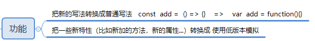

# 什么是babel

babel是一款基于node开发的工具，其功能是对es6的新语法和新特性进行转码。



# babel7的改进

babel7把各个功能进行了拆分到了不同的包中，所以我们需要对各个包的功能了解，比较常用的有以下

```
@babel/cli
@babel/core
@babel/preset-env
@babel/polyfill
@babel/runtime
@babel/plugin-transform-runtime
@babel/plugin-transform-xxx
```


## @babel/cli
@babel/cli是babel提供的内建的命令行工具，主要是提供babel这个命令来对js文件进行编译,这里要注意它与另一个命令行工具@babel/node的区别，首先要知道他们二者都是命令行工具，但是官方文档明确对他们定义了他们各自的使用范围：

@babel/cli 是一个适合安装在本地项目里，而不是全局安装

使用@babel/cli编译
```
babel test.js
```

@babel/node 跟node cli类似，不适用在产品中，意味着适合全局安装

使用@babel/node编译
```
babel-node test.js
```
## @babel/core

这个包是babel功能实现的核心，也就是说核心的方法都放在了这个包里边了。现在你试着用上述的转码方法转换的时候，你会发现报这样的错误：


提示找不到该`@babel/core`这个包

这个时候我们需要安装该包，命令如下：

```
npm install @bable/core -D
```
现在，尝试转码！

```js
// index.es6.js
const user = 23;
let [length] = [];
const add = (a, b) => a + b;
```
执行转码命令

```
babel index.es6.js index.es5.js
```

发现转码后的`index.es5.js`文件内容如下：

```js
// index.es5.js
const user = 23;
let [length] = [];
const add = (a, b) => a + b;
```
现在执行转码是没报错了，但是貌似没有任何变化呀！


## plugins

**什么原因呢？**

前边提过，babel7的时候把各个功能都拆分到不同的包里边去了，比如说需要把箭头函数转换成普通函数，就需要有对应的包去实现这个功能。这个包就是 `@babel/plugin-transform-arrow-functions`

类似于这样的包，在`babel`里被叫做`plugins`

我们再试一次

1. 安装`@babel/plugin-transform-arrow-functions`

```
npm install -D @babel/plugin-transform-arrow-functions
```

2. 执行转码命令

```
babel index.es6.js index.es5.js --plugins @babel/plugin-transform-arrow-functions
```

此时，我们去查看`index.es5.js`

内容如下：

```js
// index.es5.js

const user = 23;
let [length] = [];

const add = function (a, b) {
  return a + b;
};
```

我们发现箭头函数转换成功了，但是`const`,`let`之类的还是没成功，那么针对它们转码的包是`@babel/plugin-transform-block-scoping`请自行添加尝试。如果想要知道所有的插件请点击下边的链接

[点击查看插件列表](https://babeljs.io/docs/en/plugins)

如果插件很多的话，直接在命令行中输入很麻烦，那么babel给我们提供了两种方式来配置插件

1. 在项目根目录创建`.babelrc`文件，内容如下：

```json
{
    "plugins": [
        "@babel/plugin-transform-arrow-functions",
        "@babel/plugin-transform-block-scoping" 
    ]
}
```

2. 在项目根目录创建`babel.config.js`,内容如下：

```js
let plugins = [
    "@babel/plugin-transform-arrow-functions",
    "@babel/plugin-transform-block-scoping" 
]
module.exports = {plugins}
```

这两种配置方法都可以让我们的命令行不用写这么多内容

## presets

在理解了`plugins`之后,接下来要说一说`presets`,现在我们在使用`plugins`已经很方便了，但是每次配置的时候，都要写一堆的插件还要下载依然是很麻烦的，这个时候`presets`的作用就出来了，`presets`说好听点叫预设，说直白点叫插件包，它能够帮我们提前把一些要用到的插件归类好。

也就是说`presets`中包含了我们所需要的常用插件，如果你想要自定义一些插件，你可以`presets`和`plugins`配合在一起使用

常用的`presets`列表如下

- @babel/preset-env
- @babel/preset-flow
- @babel/preset-react
- @babel/preset-typescript

配置的时候，是跟`plugins`配置在一起的，如下

1. 使用`.babelrc`
```json
{
    "presets": [
        "@babel/preset-env"
    ],
    "plugins": [

    ]
}
```
2. 使用`babel.config.js`

```js
const plugins = [];
const presets = [];
module.exports = {plugins,presets}
```


## @babel/polyfill

`polyfill`我们又称垫片，见名知意，所谓垫片也就是垫平不同浏览器或者不同环境下的差异

因为有的环境支持这个函数，有的环境不支持这种函数，解决的是有与没有的问题，这个是靠单纯的`@babel/preset-env`不能解决的。

`@babel/preset-env`解决的是将高版本写法转化成低版本写法的问题，因为不同环境下低版本的写法有可能不同而已。


在这个包中给我们提供了浏览器一些高级特性的方法实现,比如`findIndex`这个方法在低版本语言中是不存在的，那么我们需要手动实现这个方法，那么这个方法的实现已经把放进了`@babel/polyfill`这个包中。

所以，我们只要在项目引入这个包即可

```js
index.es6.js

import '@babel/polyfill'

// ....
```

## @babel/runtime

因为babel在转码的时候可能会生成一堆的`helper`(辅助函数)，这些`helpler`被全部放在了`@babel/runtime`这个包里边。如果没有安装`@babel/runtime`在转码的时候，这些`helper`会直接生成在代码中。如果同样的特性都进行转码的话，会造成代码冗余。这也正是`@babel/runtime`存在的原因。

## @babel/plugin-transform-runtime

用了`@babel/runtime`只能保证提供了`helper`，但是还需要我们引入到我们的项目中。而`@babel/plugin-transform-runtime`就是来干这个事情的。

配置如下：

```json
{
    "plugins": [
        "@babel/plugin-transform-runtime"
    ]
}
```


# 后续内容敬请期待....


