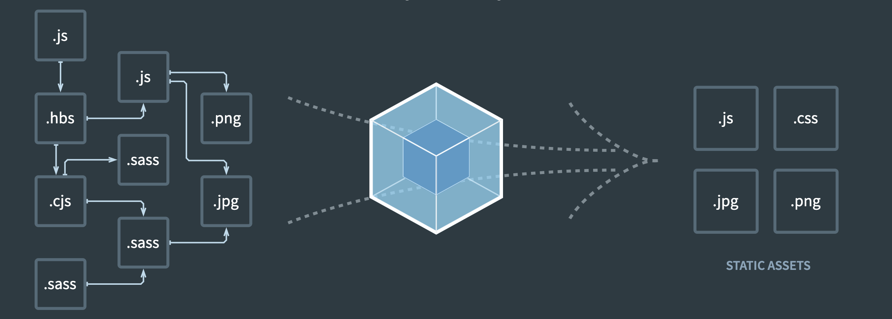
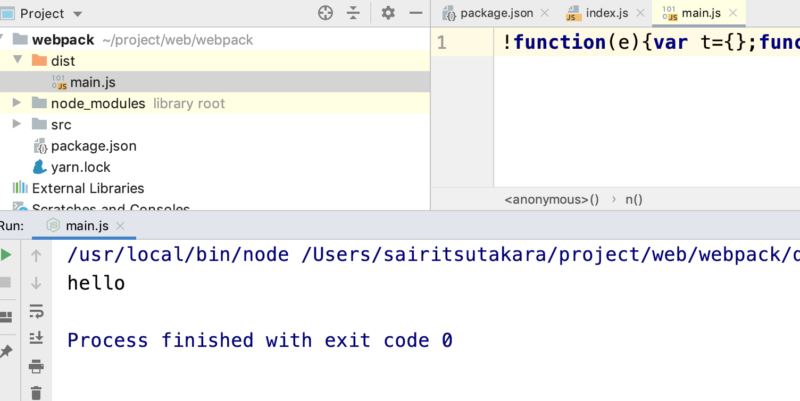

# webpack

## 

## 可以做的事情

> 代码转换、文件优化、代码分割、模块合并、自动刷新、代码校验、自动发布

## 需要掌握的内容

> npm、node、es6语法

## 最终目的

- webpack的基本配置
- webpack的高级配置
- webpack的优化策略
- ast抽象语法树
- webpack的Tapable
- 掌握webpack的流程 手写webpack
- 手写webpack中常见的loader
- 手写webpack中常见的plugin


## 1. 安装webpack

- webpack
- webpack-cli

## 2. webpack可以0配置

- 打包：npx webpack 命令



> 如果是vscode的话 需要安装code runnder插件 可直接运行

### 2.1 生产环境和开发环境

> production：生产环境 压缩 比较小巧 
>
> development：开发环境 ： 不会压缩

通过 mode 就可以设置环境 

## 3. 手动配置

- 新建webpack.config.js.         


> ` package.json`

```js
{
  "name": "cuilb_webpack",
  "version": "1.0.0",
  "description": "",
  "main": "index.js",
  "scripts": {
    "build": "webpack --config webpack.config.js",
    "dev": "webpack-dev-server"
  },
  "keywords": [],
  "author": "",
  "license": "ISC",
  "devDependencies": {
    "html-webpack-plugin": "^3.2.0",
    "webpack": "^4.41.0",
    "webpack-cli": "^3.3.9",
    "webpack-dev-server": "^3.8.2"
  }
}

```

>  `webpack.config.js`

```js
let path = require("path");
let HtmlWebpackPlugin = require("html-webpack-plugin");
module.exports = {
  devServer: {//静态服务器的配置
    port: 3000,
    progress: true,//进度提哦啊
    contentBase: "./dist",//静态资源路径
    compress:true//是否压缩
  },
  mode: "production",//环境
  entry: "./src/index.js",
  output: {
    filename: "bundle[hash:8].js",//设置hash之后会解决浏览器缓存问题
    path: path.resolve(__dirname, "dist")//解析 会把相对路径解析成绝对路径
  },
  plugins: [
    new HtmlWebpackPlugin({
      template: "./src/index.html",
      filename: "index.html",
      minify:{
        removeAttributeQuotes:true,//去除双引号
        collapseWhitespace:true//单行压缩
      },
      hash:true//是否加hash后缀
    })

  ]
};

```


