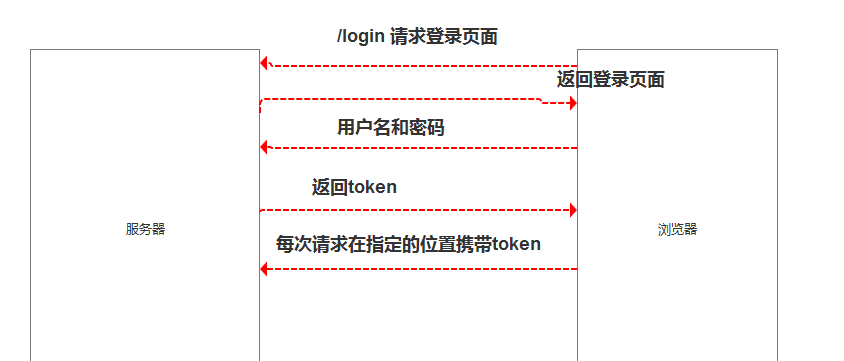
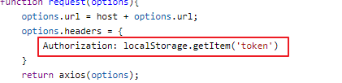
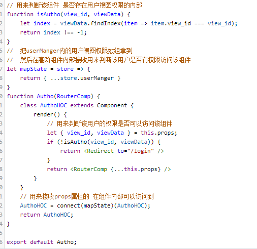
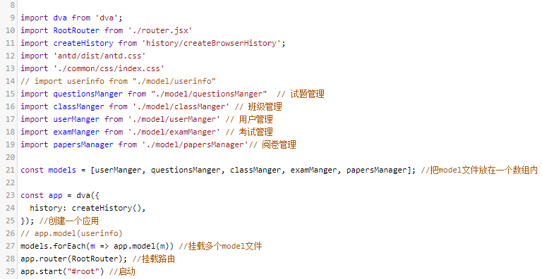

## 用户权限，前端怎么判断路由权限
1. 前端跟后端交互的时候如何验证权限呢？一般是前端发送用户名和密码给服务端，然后服务端返回一个token，这个token就代表了用户的身份和权限信息。之后的请求只要都携带该token就可以了。如下图


代码如下：



2. 在前端如何控制用户的权限信息呢？实现的效果是当用户不具备该路由权限的时候不能够访问，在react中一般的做法是，封装一个高阶组件，在所有的路由组件上都应用该高阶组件，该高阶组件所实现的逻辑是判断当前身份是否具备访问该路由的权限，如果具备就加载该路由组件，否则就不允许加载，具体代码如下：



## 跨域
1. 什么是跨域呢？一般来说跨域只会对ajax和fetch的请求有限制，当我们发起请求的载体页面所在的服务器的协议、域名、端口和该请求目标的协议、域名、端口有不一致就是跨域。
2. 如何解决跨域呢？一般有三种方式
- jsonp，这种方式是通过script的src属性去请求，当然这种方式发起的请求已经不属于ajax或者fetch了。而且该方式只能是get方式的，一般这种方式后端返回的是一段javaScript脚本
- 反向代理，这种方式主要是避免载体页面的域（代理服务器）和请求的目标域不一致，因此，请求的目标域就是载体页面的域（代理服务器），由代理服务器再转发至目标服务器，避免了跨域。
- 跨域资源共享，一般在相应头添加 如下字段
```js
'Access-Control-Allow-Origin':'*'
```

## 配置按需加载 ant design

可以通过以下的写法来按需加载组件。

```js
import Button from 'antd/lib/button';
import 'antd/lib/button/style'; // 或者 antd/lib/button/style/css 加载 css 文件
```

如果觉得麻烦的话，可以使用插件` babel-plugin-import `,我们就可以像下边这样采用更加简洁的方法了
```js
import { Button } from 'antd';
```
## dva是什么，怎么用

dva 首先是一个基于 redux 和 redux-saga 的数据流方案，然后为了简化开发体验，dva 还额外内置了 react-router 和 fetch，所以也可以理解为一个轻量级的应用框架。

具体的用法如下： 



## 组件传参

分为以下几种情况：
1. 父向子传参使用props
2. 子向父传参 一般是父向子传一个函数，然后子去调用这个函数并传递参数
3. 跨级传参，可以使用context或者发布订阅模式
4. 使用状态管理的库例如：mobx或者redux
## webpack的配置
```
entry  入口

output: {
    path: 打包的路径
    filename: 打包生成的文件
    publicPath: 输出解析文件的目录
}

module: 配置各种loader
resolve: 解析模块请求的选项
devServer: 开发服务器相关的配置
plugins: 各种插件的配置
```


