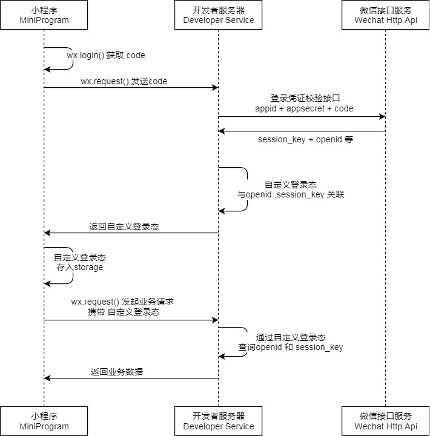
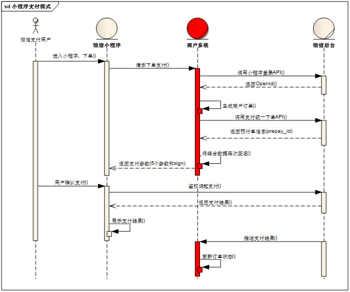
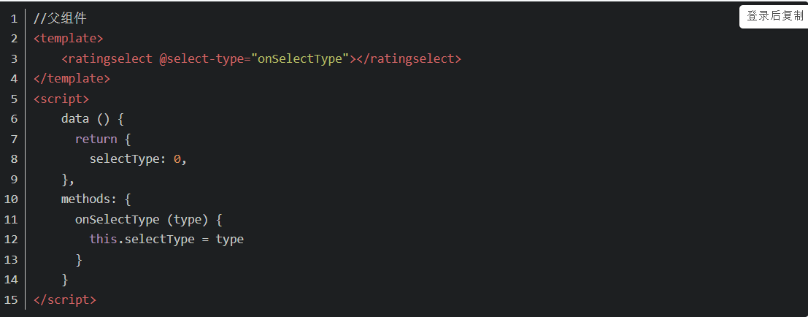
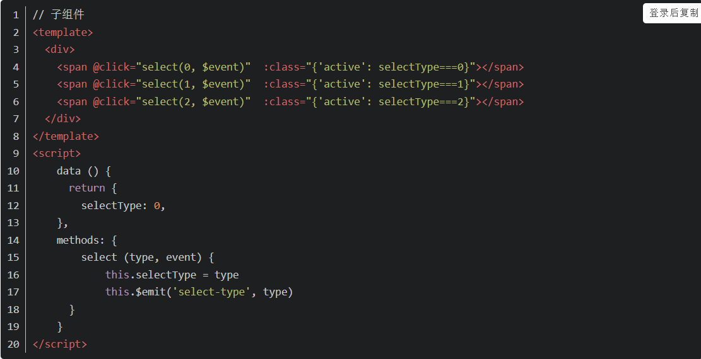

```
一、问题：vue路由与react路由的区别
答案：vue-router是全局配置方式，react-router是全局组件方式。
vue-router仅支持对象形式的配置，react-router支持对象形式和JSX语法的组件形式配置。vue-router任何路由组件都会被渲染到<router-view>位置，react-router子组件作为children被传入父组件，而根组件被渲染到<Router>位置

二、问题：promise是什么
答案：promise是异步编程的一种解决方案，从语法上讲，promise是一个对象，从它可以获取异步操作的信息；从本意上讲，它是承诺，承诺它过一段时间会给你一个结果。Promise有三种状态：pending(等待态),fulfiled(成功态),rejected(失败态)：状态一旦改变，就不会再变，创建promise实例后，他会立即执行。


三、问题：async、await是什么
答案：async顾名思义是“异步”的意思，async用于声明一个函数是异步的。而await从字面意思上是“等待”的意思，就是用于等待异步完成。并且await只能在async函数中使用，通常async、await都是跟随Promise一起使用的。为什么这么说呢？因为async返回的都是一个Promise对象同时async适用于任何类型的函数上。这样await得到的就是一个Promise对象(如果不是Promise对象的话那async返回的是什么 就是什么)；await得到Promise对象之后就等待Promise接下来的resolve或者reject。

四、问题：vuex是什么的
答案：Vuex 是一个专为 Vue.js 应用程序开发的状态管理模式。它采用集中式存储管理应用的所有组件的状态，并以相应的规则保证状态以一种可预测的方式发生变化。Vuex 也集成到 Vue 的官方调试工具 devtools extension，提供了诸如零配置的 time-travel 调试、状态快照导入导出等高级调试功能

五、问题：redux怎么使用
答案：Redux 是 JavaScript 状态容器，提供可预测化的状态管理。 (如果你需要一个 WordPress 框架，请查看 Redux Framework。)，可以让你构建一致化的应用，运行于不同的环境（客户端、服务器、原生应用），并且易于测试。不仅于此，它还提供 超爽的开发体验，比如有一个时间旅行调试器可以编辑后实时预览。Redux 除了和 React 一起用外，还支持其它界面库。 它体小精悍（只有2kB，包括依赖）
```

##### 六、小程序登录流程




##### 小程序支付流程




#### 小程序跳转tabBar使用（wx.switchTab）


#### 说说vue中的子向父传值是怎么实现的？




```
父组件使用@select-type="onSelectType"监听由子组件vm.$emit触发的事件，通过onSelectType()接受从子组件传递过来的数据，通知父组件数据改变了。
子组件通过$emit来触发事件，将参数传递出去。

说说事件委托
事件委托是利用事件的冒泡原理来实现的，何为事件冒泡呢？就是事件从最深的节点开始，然后逐步向上传播事件，举个例子：页面上有这么一个节点树，div>ul>li>a;比如给最里面的a加一个click点击事件，那么这个事件就会一层一层的往外执行，执行顺序a>li>ul>div，有这样一个机制，那么我们给最外面的div加点击事件，那么里面的ul，li，a做点击事件的时候，都会冒泡到最外层的div上，所以都会触发，这就是事件委托，委托它们父级代为执行事件。

js中的堆和栈
说到堆栈，我们讲的就是内存的使用和分配了，没有寄存器的事，也没有硬盘的事。
各种语言在处理堆栈的原理上都大同小异。堆是动态分配内存，内存大小不一，也不会自动释放。栈是自动分配相对固定大小的内存空间，并由系统自动释放。
javascript的基本类型就5种:Undefined、Null、Boolean、Number和String，它们都是直接按值存储在栈中的，每种类型的数据占用的内存空间的大小是确定的，并由系统自动分配和自动释放。这样带来的好处就是，内存可以及时得到回收，相对于堆来说，更加容易管理内存空间。
javascript中其他类型的数据被称为引用类型的数据 : 如对象(Object)、数组(Array)、函数(Function) …，它们是通过拷贝和new出来的，这样的数据存储于堆中。其实，说存储于堆中，也不太准确，因为，引用类型的数据的地址指针是存储于栈中的，当我们想要访问引用类型的值的时候，需要先从栈中获得对象的地址指针，然后，在通过地址指针找到堆中的所需要的数据。
说来也是形象，栈，线性结构，后进先出，便于管理。堆，一个混沌，杂乱无章，方便存储和开辟内存空间

说说jsonp,jsonp在后台做了什么?
请求方：qianduan.com 的前端程序员（页面）
响应方：houduan.com 的后端程序员（服务器）

请求方创建script，src指向响应方，同时传一个查询参数 ?callbackName=yyy

响应方根据查询参数callbackName，构造形如
（1）yyy.call(undefined, ‘你要的数据’）
（2）yyy(‘你要的数据’）
这样的响应
浏览器接收到响应，就会执行yyy.call(undefined,'你要的数据’)
那么请求方就知道了他要的数据
这就是JSONP
在后台，通过前端回调函数callback传过来的参数，然后查询这个参数，执行后返回前端想要的数据

做项目时，数据是怎么请求的？
一般是使用axios;

用axios是使用什么方式请求的？
如果是登录注册向后台传递数据的话，用post;如果是获取数据，一般使用get;

请求数据是遇到那些问题？
数据参数有误；跨域；

跨域是怎么解决的？
第一种是用proxy代理解决；第二种是jsonp跨域

如果代理做好了，用post请求还是报跨域的错，这个怎么解决？
将post请求的headers中的content-type的值从application/
x-wwww-form-urlencoded修改为text/plain，然后重新发送请求.
有几种实现左中右的布局？
float是第一种方法；position定位是第二种；flex是第三种；

重绘和回流的区别是什么？ 
重绘：页面元素外观发生变化，不影响布局时，产生重绘.
回流：页面布局发生改变或是需要重新计算属性值时，引起回流.
回流必将引起重绘，重绘不一定会引起回流.

怎么使元素垂直居中？
第一种position定位；第二种position+transfrom；第三种margin;第四种padding;第五种display:inline-block;第六种vertical-align:middle;第七种line-height;

var a;
(function(){
console.log(a);
a = 1;
console.log(a);
})()
打印结果是什么？undefined,1

vue的生命周期有哪些？
vue的生命周期共分为5个阶段：数据初始化，dom挂载，数据更新，缓存，组件卸载；
其中每个阶段各有2个生命周期：
beforeCreate,created,beforeMount,mounted,beforeUpdate,updated,activated,deactiveted,beforeDestroy,destroyed

map 和 forEach 的区别 ？
   map 有返回值  forEach 没有返回值

页面内容水平居中的办法？
   定位 left:0; right:0;top:0;bottom:0; margin:0 auto;
   定位 top: 50%; left: 50%; margin-left:宽的一半;  margin-top: 高的一半; 
   定位 left:50%; top:50%; transform:translate(-50%,-50%);    
   display:flex;justify-content: center; align-items:center;
   

清除浮动方法？
   在浮动元素下面添加一个空标签，在这个标签中设置clear：both；
   父元素定义overflow:hidden，此时，浏览器会自动检查浮动区域的高度
   父元素设置高度
   父级设置overflow：auto
   父级div定义display:table

小程序页面间有哪些传递数据的方法？ 
   使用全局变量实现数据传递
   页面跳转或重定向时，使用url带参数传递数据
   使用组件模板 template传递参数
   使用缓存传递参数
   使用数据库传递数据 	
 
get和post 区别？
   get请求类似于查找的过程，用户获取数据，可以不用每次都与数据库连接，所以可以使用缓存。
   post不同，post做的一般是修改和删除的工作，所以必须与数据库交互，所以不能使用缓存。因此get请求适合于请求缓存。

let a = ()=>{

   return a

}
function b(){
   return b

}
console.log(a.prototype)//undefined   （箭头函数没有原型属性）
console.log(b.prototype)//函数b的原型

react父子传值，子父传值?
父子传值通过props传递，子组件通过this.props接收父组件传过来的值

子组件更新组件状态，通过回调函数的方式传递给父组件。
子组件调用父组件通过props传给它的函数更新父组件state，进而完成子组件向父组件的通讯。

怎么用原生js模拟虚拟dom？
  可以创建一个js对象来模拟dom   虚拟dom就是通过编译器将jsx转化成为React.createElement()方法的调用。这个方法返回的就是一个js对象（虚拟dom）
let obj = {
    tag:"ul",
    props:{
        class:"uls"
    },
    children:{
        tag:"li",
        children:"标签内容"

    }
}

Vue自定义指令
例子v-fous
注册全局指令 
Vue.directive('focus，{
 当被绑定的元素插入到 DOM 中
inserted:function(el){
 聚焦元素
el.focus()
}
})

 注册局部
directives: {
  focus: {
    // 指令的定义
    inserted: function (el) {
      el.focus()
    }
  }
}

 封装插件思想
vue的插件 暴露一个 install 方法
第一个参数是vue构造器 第二个是可选的选项对象
添加全局的方法和属性
全局的资源 注入组件选项 添加实例方法

错误边界
错误边界是一种 React 组件这种组件可以捕获并打印发生在其子组件树任何位置的 JavaScript 错误，并且，它会渲染出备用 UI，而不是渲染那些崩溃了的子组件树。错误边界在渲染期间、生命周期方法和整个组件树的构造函数中捕获错误。
注意
错误边界无法捕获以下场景中产生的错误：
事件处理
异步代码
服务端渲染
它自身抛出来的错误（并非它的子组件）
错误边界的工作方式类似于 JavaScript 的 catch {}，不同的地方在于错误边界只针对 React 组件。只有 类组件才可以成为错误边界组件。大多数情况下, 你只需要声明一次错误边界组件, 并在整个应用中使用它。

 hook 
Hook 是 React 16.8 的新增特性。它可以让你在不编写 class 的情况下使用 state 以及其他的 React 特性。Hook 是一个特殊的函数
函数组件也可以用state现在你可以在现有的函数组件中使用 Hook。
不要在普通的 JavaScript 函数中调用 Hook,他的作用是组件复用，多个useState的相互独立。

 React 三大主体
组件  数据 路由

 Vue 三大主体
组件  数据 路由

路由按需加载 （第三方插件）
react-loadable是用于通过动态导入加载组件的高阶组件。
使用的是Es6里面的import 引入。
它返回的是pomise对象

高阶组件 登录流程
利用高阶组件对登录注册的信息进行拦截
通过post方式请求接口 ，如果登录的用户名和密码都相符合的话
就跳到相对应的页面

二次封装 （封装axios）
步骤
新建http文件夹
新建 index.js config.js
在config.js对axios进行二次封装 ，进行拦截请求
和响应拦截 在index.js导入config.js,挂载在vue原型上
在全局配置引入
点击按钮触发接口 
好处：
有助于项目管理和重构，以及代码的复用,实际项目开发中，结构清晰。
减轻vue实例的负担，优化项目性能

页面中 的对话框是怎么实现的 。
	socket通信。

微信小程序和网页有区别吗？
   有区别 微信小程序运行在微信的内部 网页主要存在于服务器上

公众号从跳往小程序怎么跳的？
   点击调到a链接

小程序的适配问题
     rpx适配 vw、vh适配  ipnone X适配 wx.getSystemInfo 接口取获取设备信息

手机页面中的适配是在js中还是在css?
  css中 媒体适配 栅格  手机的宽度进行适配 页面中要用百分比 。rem 弹性盒子

矢量图 
  矢量图用在手机上怎么用的？
  矢量图 通过网站生成svg 或者 ui给我们的
  图片的适配 美工切图 网页上和手机端是两个不一样的图片。

vue的双向绑定 。
  Object.defineProperty  劫持
Observer 监听器：用来监听属性的变化通知订阅者
Watcher 订阅者：收到属性的变化，然后更新视图
Compile 解析器：解析指令，初始化模版，绑定订阅者

element ui 二次封装 弹窗 。
 怎么封装呢？
对方法： 把源码copy过来 放在自己的代码里面
样式：把样式单独列出来 
用自己二次封装的这个方法

vue的api 中 $children 中指的是嵌套的组件中 又嵌套组件 自己封装的组件 如何在外面获取到子组件中的原色的值
$option

怎么解决git上的冲突
编写代码的时候就尽量规范代码
手动解决冲突

什么样的开发工具 
vscode

webpack手撘 多入口 多出口（output）
多入口：entry  对象的方式
多出口：output  对象的方式 output: {
    filename: '[name].js',
    path: __dirname + '/dist/[hash]',
  }

多出口进行压缩  html页面
html-webpack-plugin 插件  
plugins: [
    new HtmlWebpackPlugin({
      filename: 'index.html', // 配置输出文件名和路径
      template: 'assets/index.html', // 配置文件模板
    }),
  ]

webpack执行流程（html,css,js） shell脚本  编译 按需加载（module）  打包成app.js  

loader的作用  （可以把 loader 理解为是一个转换器，负责把某种文件格式的内容转换成 webpack 可以支持打包的模块。）
style-loader的作用(style-loader是将css-loader打包好的css代码以<style>标签的形式插入到html文件中。)

react与vue的区别（使用和原理方面（编译过程，更新过程））
组件的创建方式不一样（vue是使用的vue的components方法和components属性  react是使用class和函数创建组件）
react中没有指令和计算属性和watch和computed
react只有生命周期 state props 合成事件
vue中可以使用v-model完成控件和属性值的同步（双向的数据绑定）react则使用受控组件
vue中使用set get拦截器，处理数据的绑定  react则使用的是setState

token分为哪几个部分？
答：组成token的有，Uid（用户唯一的身份标识）、time（当前时间的时间戳）、sign（签名，token的前几位以哈希算法压缩成的一定长度的十六进制字符串。为防止token泄露）。

2.vuex中模块a想要引用模块b里的数据，如何实现？

在action中有rootState,rootGetters，相当vue中的所有的state,getter,可以使用rootGetters['xxx'],来获取其他模块的getters,state。

3.关于token防止csrf的攻击。

表单：在 Form 表单中添加一个隐藏的的字段，值是 csrf_token。

非表单：在ajax获取数据时，添加headers:{ 'X-CSRFToken':getCookie('csrf_token') }。

4.组件封装

首先，使用Vue.extend()创建一个组件
然后，使用Vue.component()方法注册组件
接着，如果子组件需要数据，可以在props中接受定义
最后，子组件修改好数据之后，想把数据传递给父组件，可以使用emit()方法

5.canvas(x,y轴,随机颜色,动画)

<canvas id="test-canvas" width="300" height="200"></canvas>
var canvas = document.getElementById('test-shape-canvas');
var ctx = canvas.getContext('2d');
ctx.fillRect(10, 10, 130, 130);

1.vue组件的封装？
a.首先，使用vue.extend()创建一个组件
b.然后，使用vue.component()方法注册组件
c.接着，如果子组件需要数据，可以在props中接受定义
d.最后，子组件修改好数据之后，想把数据传递给父组件，可以使用emit()方法

2.js运行机制？
答案：js的运行机制是按顺序一个接一个的执行，前一个执行完才执行下一个，所有的执行任务分两个：同步任务和异步任务。
异步任务又分两个：微任务和宏任务。微任务：new Promise().then(回调),process.nextTick 。 
宏任务:script(全局任务)，setTimeout,setInterval,setImmeddiate,I/O,UI rendering。、
在执行时，先执行同步任务，同步任务执行完毕后，会执行微任务队列里的任务，微任务执行完毕后，
会读取宏任务队列中排在前面的任务，执行宏任务过程中，遇到微任务，依次将其加入微任务队列，
栈空后，再次读取微任务队列里的任务，微任务执行完毕后再去执行其他宏任务队列里的宏任务，依次类推。

3.ES6的新特性？
答案：（1）不一样的变量声明：const和let
			let声明局部变量，const声明常量，两者都为块级作用域；const声明的变量都为常量，
意思是被设置完成后就不能修改了。let关键词声明的变量不具备提升变量的特性 ，
let和const声明指在靠近的一个块中有效，const在声明时必须被赋值
			
（2）箭头函数：特点：1.不需要function关键字来创建函数 2.省略return关键字 3.继承当前上下文的this关键字

（3）模板字符串：ES6之前通过'\'和'+'来构建模板，ES6:a.基本的字符串格式${}
			b.ES6反引号(``)
			
（4）Spread/Rest操作符：Spread/Rest操作符指的是...

（5）二进制和八进制字面量：ES6支持二进制和八进制的字面量，通过在数字前面添加0o或者0O即可将其转换为八进制值

（6）对象和数组结构：
//对象
const student = {
    name: 'Sam',
    age: 22,
    sex: '男'
}
// 数组
// const student = ['Sam', 22, '男'];

// ES5；
const name = student.name;
const age = student.age;
const sex = student.sex;
console.log(name + ' --- ' + age + ' --- ' + sex);

// ES6
const { name, age, sex } = student;
console.log(name + ' --- ' + age + ' --- ' + sex);

（7）对象超类：ES6允许在对象中使用super方法：
var parent = {
  foo() {
    console.log("Hello from the Parent");
  }
}
 
var child = {
  foo() {
    super.foo();
    console.log("Hello from the Child");
  }
}
 
Object.setPrototypeOf(child, parent);
child.foo(); // Hello from the Parent
             // Hello from the Child

（8）for...of和for...in
for..of用于遍历一个迭代器，数组
for...in用于遍历对象中的属性

（9）ES6中的类

4.apply,call和bind
call方法第一个参数是要绑定给this的值，后面传入的是一个参数列表。当第一个参数为null、undefined的时候，默认指向window
apply接受两个参数，第一个参数是要绑定给this的值，第二个参数是一个参数数组。当第一个参数为null、undefined的时候，默认指向window。
call和apply的用法几乎相同，唯一的差别在于：当函数需要传递多个变量时，apply可以接受一个数组作为参数输入，call则是接受一系列的单独变量。如果参数本来就存在一个数组中，那自然就用apply,如果参数比较散乱相互之间没什么关联，就用call.
bind第一个参数是this的指向，从第二个参数开始是接受的参数列表，区别在于bind方法返回值是函数以及bind接受的参数列表的使用，bind方法不会立即执行，而是返回一个改变了上下文this后的函数。
call,apply和bind函数存在的区别：bind返回对应函数，便于稍后调用，apply,call则是立即调用

5.Object.prototype.toString.call(),instanceof,typeof
答案：Object.prototype.toString.call()可以判断任何类型，包括对null,undefined的判断
		instanceof是通过判断对象的原型链中是否能找到类型的prototype,能在实例上找到类型,返回boolean
		typeof的缺陷就是判断null的时候，返回为Object
		
5.axios的二次封装
import axios from 'axios'
import Cookie from 'js-cookie'

let request=axios.create({
  baseURL: process.env.NODE_ENV !== "production" ? '/api' : ''
})

//请求拦截
request.interceptors.request.use((config)=>{
    config.headers.authorization=Cookie.get('token')
    // console.log(config.headers.authorization)
    return config
},(error)=>{
    return Promise.reject(error)
})

//响应拦截
request.interceptors.response.use((response)=>{
    return response.data
},(error)=>{
    return Promise.reject(error)
})


let get=(url,params)=>request.get(url,{params})
let post=(url,data)=>request.post(url,data)
let put=(url,data)=>request.put(url,data)
let deletes=(url,data)=>request.delete(url,{data})

export {get,post,put,deletes}

6.登录过程
a.第一次登录的时候，前端调用后端的登录接口，发送用户名和密码
b.后端收到请求，验证用户名和密码，验证成功，给前端返回一个token
c.前端拿到token,将token存储到cookie中，并跳转路由页面
d.前端每次跳转路由，判断cookie中有无token，没有就跳转到登录页面，有则就淘到对应陆游的页面
e.每次调用接口，都需要在请求头中加token
f.判断请求头中有无token，有token，就拿到token并验证token,验证成功就返回数据，验证失败就返回401，如果为401就跳转到登录页面通过路由前置守卫。

1、vue单页面
单页面就是指只有一个主页面的应用，他的页面切换是通过导航栏的hash来做一个路由切换。他的优点是页面切换快，
用户不用等待每次切换页面的重新加载，而且还有转场动画。缺点是首次加载要加载的东西很多，加载速度较慢，
还不利于做seo优化。

2、seo优化
（1）、减少http请求，合理设置 HTTP缓存
（2）、使用浏览器缓存
（3）、启用压缩
（4）、 CSS Sprites(雪碧图)
（5）、CSS放在页面最上部，javascript放在页面最下面
（6）、异步请求 Callback（就是将一些行为样式提取出来，慢慢的加载信息的内容）

3、vue单页面首屏加载速度优化方案
（1）、使用CDN资源，减少服务器宽带压力
（2）、路由懒加载
（3）、首屏为登录页，可以做成多入口，登录页单独分离为一个入口
（4）、按需加载三方资源

4、react组件性能优化？
（1）、尽量多使用无状态函数构建组件
【因为无状态组件不会像React.creaClass和Es6 class会在调用时创建新实例，它创建时始终保持了一个实例，避免了不必要的检查和内存分配，做到了内部优化。】
（2）、运用PureRender，对变更做出更少的渲染
【在默认情况下shouldComponentUpdate方法返回true，React会重新渲染所有的节点】
（3）、拆分子组件
【拆分子组件拆分组件为子组件，对组件做更细粒度的控制。保持纯净状态，可以让方法或组件更加专注(focus)，体积更小(small)，更独立(independent)，更具有复用性(reusability)和可测试性(testability)。】

5、vue性能优化？
（1）、图片优化[大小优化，减少请求]
（2）、页面性能优化[图片懒加载，组件懒加载]
（3）、图片预加载
（4）、第三方拆件懒加载

说说你对HTTP协议的理解？
HTTP协议是构建在TCP/IP协议之上的，是TCP/IP协议的一个子集
TCP/IP分为4层：
1）应用层
	应用层一般是我们编写的应用程序，其决定了向用户提供的应用服务，通过系统调用与传输层进行通讯
	2）传输层
传输层通过系统调用向应用层提供处于网络连接中的两台计算机之间的数据传输。
	3）网络层
网络层用来处理在网络上流动的数据包，数据包是网络传输的最小数据单位。该层规定了通过怎样的路径（传输路线）到达对方的计算机，并且把数据包传输给对方
	4）链路层
链路层用来处理网络的硬件部分，包括控制操作系统、硬件设备驱动等。	
总结：当浏览器输入一个URL地址后，浏览器会去查询域名的IP地址，然后返回一个域名的IP地址，第三部生成一个HTTP请求，发送一个HTTP请求，生成HTTP回复，传输HTTP回复。
但是HTTP的缺点就是不够安全，那怎么能让他安全呢？那就是对其进行加密，就形成了一个我们看到的HTTPS，虽然看起来是多了一个S，但是肯定不是看起来那么简单的，在HTTP与TCP/IP层中间加入一个SSL，也就是一个安全证书，这个安全证书指的是CA证书，当A向B发送请求的时候，会想CA官方发出请求，CA官方会生成一个属于CA官方认证的公钥与私钥发送给B，而B这边在读取的时候，需要有CA给自己生成的一个公钥与私钥，双方确认都是由CA官方派发的公钥才可以解密，进行对话。

说一下react与vue的区别
首先构建工具不一样：react使用create-react-app  vue使用vue-cli,但是这两个工具都可以为你创建一个好的环境，不过create-react-app会强迫你使用webpack和babel，而vue-cli可以按需创建不同的模板，使用更加灵活。
数据流不一样，虽然说都是单向数据流，但是方式上是有区别的
1.vue1.0     Parent---porps----child----v-model----DOM
2.Vue2.0     Parent---porps----child----v-model----DOM
3.React      Parent---porps----child----sgate----DOM
模板渲染方式不同
Vue跟react的模板有所区别，react是通过JSX来渲染模板的，而vue是通过扩展的HTML来进行渲染的。React通过原生js实现模板中的常见语法，比如说条件，循环，三元运算等，都是js语法，而vue是在和组件代码分离的单独模板中，通过指令v-if\v-for等实现。
React比较好点，比如定义一个组件，react使用import引入可以直接在render函数内使用，但是，vue需要import引入，在components去声明才可以用。

说一下你对promise的理解
	首先我们先想一个问题，为什么要用promise呢？比如我们发起一个请求，在这个请求完成之后才可以发起下一次请求，一直这样嵌套下去，就会形成一个回调地狱，我们每次都要对这样的代码进行一些处理，对于代码的优化非常的痛苦，可读性差，耦合度过高，可维护性差，代码复用性差，只能在回调函数内部处理异常。那么我们就可以使用异步来处理。
什么是promise呢？是一种异步编程的解决方案，比传统的异步解决方案回调和事件更加合理，更加的强大。
常用的API：promise.resolove(value)成功、promise.reject()失败、promise.race(),多个promise一起执行，不管成功还是失败，返回最先执行结束的promisere任务结果。Promise.all,多个promise一起执行，类似数组的方法，返回所有成功任务的promise结果，如果有一个失败的，则返回失败的结果。
可以使用两种方法创建
1.new Promise(fn)
2.Promise.resolove(fn)
调用返回的结果，执行then方法，可以带参数，也可以不带参数，如果then中的函数依赖上一步返回的结果，那就必须带上参数。
最后注册catch异步处理函数，处理前面回调函数中可能抛出的异常。
在后续的升级中,ES6中出现了generator以及ES7中的async/await语法。使异步处理起来更像同步，可读性更好。
记住new Promise这个是同步，而后面的.then是个异步函数。
async方法是异步的方法，而await则是个同步的方法。

1.如果不想用<div>作为标签来使用的话，可以用任意英文来写标签么？例如<abc>
答案：
	在HTML5中可以自定义语义化标签，可以直接用document.createElement("abc")来定义一个标签名，然后把标签放到页面中，不能用汉字只能用英文；

2.vue实现双向绑定的原理
答案：
	通过Object.defineProperty(),来劫持setter和getter属性，从而实现双向绑定；

3.解释一下MVC；react算MVC么？
答案：
	M：modal     V：view     C：control
	react不算MVC，只有C，因为它通过虚拟DOM，一层一层像树一样，然后到根组件，再推到页面，所以说react主要都是C层（控制层）

4.	var a;   
	console.log(a);
	console.log(b);    打印结果是？
答案：
	undefined，报错

5.日期的数据类型属于什么类型？
答案：
	Object类型

6.数组可以push进去函数么？
答案：
	可以

7.	var arr=[10,12]；使得输出结果为[12,10]？
答案：
	arr.reverse()

8.	var arr = [1,3,6,4,5,7,10]；从小到大顺序排列；
答案：
	arr.sort()

9.react中的路由标签Router中的path中有一个，默认这个会加载哪一个组件，比如component，如果不用component的话，可以拿什么去指向这个组件？
答案：
	render( (props)=><component {...props} /> )

10.react 中的render方法和component的区别是什么？
答案：
	component={组件}是直接挂在到了router下面；render={ ()=>{组件} }本身就是个组件，在组件内部在引用你定义的组件，相当于又加了一层，this指向已经不一样了

11.怎么样实现路由的精准匹配？
答案：
	exact

12.<Switch></Switch>标签的作用是什么？如果不用这个标签有什么影响？
答案：
	匹配路由的时候直接匹配第一个路由，如果不用这个标签的话就会出现路由页面叠加的问题；

13：盒模型？
答案：
	是由border、margin、padding、content组成的一个盒子；

14：给文字添加一个下划线？
答案：
	text-decoration：underline；


发起请求后浏览器发生了什么？
A、重定向
B、应用缓存
C、DNS进行解析
D、TCP建立连接
E、Require发起请求
F、Response响应
3、三次握手
A、建立连接，客户端向服务器发送syn包，等待服务器确认
B、服务器收到syn包，必须确认客户端的syn包，并且发出自己的syn包。
C、客户端收到服务器的syn包，向服务器发送确认包ACK，此包发送完毕，客户端和服务端进入连接成功状态。
4、this.$router.go()与this.$router.back()的区别？
This.$router.go()可以返回任意一页；
This.$router.back()只可以返回上一页

关于页面定位中的相对定位和绝对定位有什么区别？
   相对定位：在原位置上占用空间，可以设置浮动的上下位置。           position: relative
   绝对位置：在原位置上，不占用空间，设置位置会以整个页面为标准 position: absolute
三次握手，四次挥手，
this指向的问题
==与===的区别

三个=是全等，值和类型，两个等判断的是值
css样式可以用哪种方式引用，优先级是怎么样的，
   link import 在页面加载时link就加载了

1.React和Vue有什么区别？
react整体是函数式的思想，把组件设计成纯组件，状态和逻辑通过参数传入，所以在react中，是单向数据流，而vue的思想是响应式的，也就是基于是数据可变的，通过对每一个属性建立Watcher来监听，当属性变化的时候，响应式的更新对应的虚拟dom。
2.get和post有什么区别？
get和post在本质上没有区别，他们是http协议中的两种发送请求的方法，http是基于TCP/IP的关于数据如何在万维网中如何通信的协议。http的底层是TCP/IP所以get和post的底层也是TCP/IP,也就是说，get/post都是TCP链接。get和post能做的事情都是一样一样的，你要给get加上request body，给POST带上url参数，技术上市完全行得通的
3.如何获取react中的真实dom？
使用ref获取
在标签中写入一个匿名函数
在标签中加入一个回调函数
4.如何解决适配问题？
使用rem对样式进行尺寸的设置
使用尺寸大的图片在移动端中
5.redux中createStore可以传入几个参数，分别是什么？
第一个是reducer，接收两个参数，分别是当前state树和要处理的action，返回新的state，第二个参数是[initialState],初始时的state，在同构应用中，你可以决定是否把服务器传来的state水和后传给它，或者从之前保存的用户会话中恢复一个传给它，如果你使用combinReducers创建reducer，他必须是一个普通对象，与传入的keys保持同样的结构，否则，你可以自由传入任何reducer可理解的内容第三个参数是enhancer，是一个组合store creator的高阶函数，返回一个新的强化过的store creator，这与middleware相似，他也允许你通过复合函数改变store接口
6.vuex的应用及使用场景？
Vuex是一个专门为Vue.js应用程序开发的状态管理模式，它采用集中式存储管理应用的所有组件的状态，并以相应的规则保证状态以一种可预测的方式发生变化
Vue一般是单项数据流，于是当我们的应用遇到多个组件共享状态时，单项数据流的简洁性很容易被破坏，多个视图依赖于同一状态
7.如何解决vuex页面刷新数据丢失问题？
可以将vuex中的数据直接保存到浏览器缓存中(sessionStorage、localStorage、cookie)
在页面刷新的时候再次请求远程数据，使之动态更新vuex的数据
在父页面向后台请求远程数据，并在页面刷新前讲vuex的数据先保存至sessionStorage
8.怎么可以再移动端使用0.5px的细线？
可以使用css3动画属性的scale缩放属性
9.怎么实现3D动画？
可以使用three.js

一次完整的HTTP请求过程
域名解析 --> 发起TCP的3次握手 --> 建立TCP连接后发起http请求 --> 服务器响应http请求，浏览器得到html代码 --> 浏览器解析html代码，并请求html代码中的资源（如js、css、图片等） --> 浏览器对页面进行渲染呈现给用户
发起TCP的3次握手
拿到域名对应的IP地址之后，User-Agent（一般是指浏览器）会以一个随机端口（1024 < 端口 < 65535）向服务器的WEB程序（常用的有httpd,nginx等）80端口发起TCP的连接请求。这个连接请求（原始的http请求经过TCP/IP4层模型的层层封包）到达服务器端后（这中间通过各种路由设备，局域网内除外），进入到网卡，然后是进入到内核的TCP/IP协议栈（用于识别该连接请求，解封包，一层一层的剥开），还有可能要经过Netfilter防火墙（属于内核的模块）的过滤，最终到达WEB程序（本文就以Nginx为例），最终建立了TCP/IP的连接。

宏任务和微任务

宏任务（macrotask）：

- 主代码块和任务队列中的回调函数就是宏任务。

- 为了使js内部宏任务和DOM任务能够有序的执行，每次执行完宏任务后，会在下一个宏任务执行之前，对页面重新进行渲染。（宏任务 -> 渲染 -> 宏任务）

微任务（microtask）：

- 在宏任务执行过程中，执行到微任务时，将微任务放入微任务队列中。

- 在宏任务执行完后，在重新渲染之前执行。

- 当一个宏任务执行完后，他会将产生的所有微任务执行完。

分别在什么场景下会产生宏任务或微任务呢：

宏任务：主代码块，setTimeout，setInterval（任务队列中的所有回调函数都是宏任务）

微任务：Promise

导致页面无法立即响应的原因  导致页面无法响应的原因是执行栈中还有任务未执行完，或者是js引擎线程被GUI线程堵塞。

html文件解析过程  这个过程是在下载html文件之后，不包括网络请求过程

1. Browser进程下载html文件并将文件发送给renderer进程

2. renderer进程的GUI进程开始解析html文件来构建出DOM

3. 当遇到外源css时，Browser进程下载该css文件并发送回来，GUI线程再解析该文件，在这同时，html的解析也同时进行，但不会渲染（还未形成渲染树）

4. 当遇到内部css时，html的解析和css的解析同时进行

5. 继续解析html文件，当遇到外源js时，Browser进程下载该js文件并发送回来，此时，js引擎线程解析并执行js，因为GUI线程和js引擎线程互斥，所以GUI线程被挂起，停止继续解析html。直到js引擎线程空闲，GUI线程继续解析html。

6. 遇到内部js也是同理

7. 解析完html文件，形成了完整的DOM树，也解析完了css，形成了完整的CSSOM树，两者结合形成了render树

8. 根据render树来进行布局，若在布局的过程中发生了元素尺寸、位置、隐藏的变化或增加、删除元素时，则进行回流，修改

9. 根据render树进行绘制，若在布局的过程中元素的外观发生变换，则进行重绘

10. 将布局、绘制得到的各个简单图层的位图发送给Browser进程，由它来合并简单图层为复合图层，从而显示到页面上

11. 以上步骤就是html文件解析全过程，完成之后，如若当页面有元素的尺寸、大小、隐藏有变化时，重新布局计算回流，并修改页面中所有受影响的部分，如若当页面有元素的外观发生变化时，重绘堆内存

每当定义一个变量、常量或者对象的时候，都会有一个存储这些值的地方，这个地方就是内存堆；

可用的内存是有限的，因此合理的使用内存是非常有必要的

内存泄漏

虽然垃圾回收器的效率很高，但是单凭一个算法并不能很好的去管理内存；

经常容易出现内存泄漏的地方：

1)：全局变量：如果不断的去创建全局变量，不管这些变量有没有被应用，他们都是存在的，在程序的整个执行过程中，他们都会滞留在某一个空间内，如果这些变量是嵌套多层的对象，那么久会占用和浪费更多的内存；

2)：事件监听器：在一个页面中，我们可以回由于一些动画效果等需求，使用到大量的监听器，监听一个事件的触发，然后去实现一些效果，但是在用户离开这个页面的时候这些监听器并没有被移除掉，那么这个也是会造成内存的泄漏的；

3)：intervals 和 timeout：在使用定时器或者延时器的时候，我们经常会和必报一起使用，比如说去抖和节流使用的时候，在我们使用闭包的时候，有时候回去定义一些变量，但是我们在处理的时候经常会只是去清除了一下 intervals 或者 timeout 并没有是清除这个闭包，这样的话，没有清除闭包，那么这些变量就也没有被清除掉，其实这还是造成大量的变量引起的内存泄漏问题；

4)：DOM的清除和操作：我们在使用DOM 去进行一些操作的时候，有时候为了性能的考虑，我们会用一个变量去赋值这个DOM，这样从另一方面，也是变量定义的一个过程，这样这个变量就一直的存在了；

调用栈

栈是一种遵循LIFO(先进后出)的规则的数据结构，用于存储和获取数据；javascript 引擎通过栈来记住一个函数中最后执行的语句所在的位置

例如：

function multify(x) { return  x * 2}
fucntion calSun() { const sum = 4 + 2 ;  return multify(sum) }
calSum()

//1)：引擎发现代码中的两个方法函数；
//2)：运行 calSum() ;
//3)：将 calSum() 压栈，并执行 sum 和的计算；
//4)：运行 multify() ；
//5)：将 multify 压栈，并执行 x * 2；
//6)：在返回结果时，将 multify 从栈中弹出，然后回到 calSum() ;
//7)：在 calSum 返回结果的时候，将calSum 从栈中弹出，然后继续执行后面的代码

/*
发现方法函数，运行他，将他压入栈，然后执行他。
返回结果的时候，将函数从栈中弹出。
*/
栈溢出

在不对栈执行弹出的情况下，可连续压栈的数目取决于栈的大小，

如果超过了这个界限还不断的压栈，最终会导致栈溢出；

chrome 浏览器将会抛出一个错误以及被称为栈帧的栈快照。

自定义指令
     Vue.directive( dir_name , {} ) 来定义全局自定义指令
Vue. directives{ dir_name : {} } 来定义局部自定义指令

     
v-if和v-for的优先级、区别
当 v-if 与 v-for 一起使用时，v-for 比v-if 优先级更高
这意味着v-if 将分别重复运行每个v-for循环中。

不同点
1、实现方式
v-if是根据后面数据的真假值判断直接从Dom树上删除或重建元素节点
v-show只是在修改元素的css样式，也就是display的属性值，元素始终在Dom树上。

2、编译过程
v-if切换有一个局部编译/卸载的过程，切换过程中合适地销毁和重建内部的事件监听和子组件； 
v-show只是简单的基于css切换；

3、编译条件
v-if是惰性的，如果初始条件为假，则什么也不做；只有在条件第一次变为真时才开始局部编译；
v-show是在任何条件下（首次条件是否为真）都被编译，然后被缓存，而且DOM元素始终被保留； 

4、性能消耗
v-if有更高的切换消耗，不适合做频繁的切换；
v-show有更高的初始渲染消耗，适合做频繁的额切换；


Vue中assets和static的区别
     相同点：
 
assets和static两个都是存放静态资源文件。项目中所需要的资源文件图片，字体图标，样式文件等都可以放在这两个文件下，这是相同点 
 
 
不相同点：
 
assets中存放的静态资源文件在项目打包时，也就是运行npm run build时会将assets中放置的静态资源文件进行打包上传，所谓打包简单点可以理解为压缩体积，代码格式化。而压缩后的静态资源文件最终也都会放置在static文件中跟着index.html一同上传至服务器
 
static中放置的静态资源文件就不会要走打包压缩格式化等流程，而是直接进入打包好的目录，直接上传至服务器。因为避免了压缩直接进行上传，在打包时会提高一定的效率，但是static中的资源文件由于没有进行压缩等操作，所以文件的体积也就相对于assets中打包后的文件提交较大点。在服务器中就会占据更大的空间。所以简单点使用建议如下：
 
将项目中template需要的样式文件js文件等都可以放置在assets中，走打包这一流程。减少体积。而项目中引入的第三方的资源文件如iconfoont.css等文件可以放置在static中，因为这些引入的第三方文件已经经过处理，我们不再需要处理，直接上传。

1.redux的原理
在React中，数据在组件中是单向流动的，数据从一个方向父组件流向子组件（通过props）,所以，两个非父子组件之间通信就相对麻烦，redux的出现就是为了解决state里面的数据问题
2.connect的原理
1）这个函数的第一个参数就是 Redux 的 store，我们从中摘取了 count 属性。你不必将 state 中的数据原封不动地传入组件，可以根据 state 中的数据，动态地输出组件需要的（最小）属性。

（2）函数的第二个参数 ownProps，是组件自己的 props。有的时候，ownProps 也会对其产生影响。

当 state 变化，或者 ownProps 变化的时候，mapStateToProps 都会被调用，计算出一个新的 stateProps，（在与 ownProps merge 后）更新给组件
3.h5的新特性
答案：video,audio,canvas,箭头函数,语义标签,SVG绘图,websocket,动画
4.一些项目上的优化
shuoldcomponentUpdate
属性传递优化
多组件优化

1.怎么解决一些浏览器不支持es6的语法的问题？
    用babel转换器转换成es5的语法，一些vue.js 、 react 或angularjs等一些框架会用到es6的语法，这些框架是一些高度结构化的语法，而他们内部集成了babel转换器，所以不用担心浏览器之间的差异。

如何让一个盒子在没有宽高的情况下绝对居中？
     div{
position: absolute;
left: 0;
right: 0;
top: 0;
bottom: 0;
margin: auto;
}
原理是：让未定义宽高的div上下左右距离都为0.然后给一个margin自适应。可以想象成一个盒子，给了四个方向的相同的力，这样就会形成一种相对的均衡力量让其停留在中间位置了。

Vue实现数据双向绑定的原理：Object.defineProperty（）
vue实现数据双向绑定主要是：采用数据劫持结合发布者-订阅者模式的方式，通过Object.defineProperty（）来劫持各个属性的setter，getter，在数据变动时发布消息给订阅者，触发相应监听回调。当把一个普通 Javascript 对象传给 Vue 实例来作为它的 data 选项时，Vue 将遍历它的属性，用 Object.defineProperty 将它们转为 getter/setter。用户看不到 getter/setter，但是在内部它们让 Vue 追踪依赖，在属性被访问和修改时通知变化。

Vue组件间的参数传递
1.父组件与子组件传值
父组件传给子组件：子组件通过props方法接受数据;
子组件传给父组件：$emit方法传递参数
2.非父子组件间的数据传递，兄弟组件传值
eventBus，就是创建一个事件中心，相当于中转站，可以用它来传递事件和接收事件。

React有什么特点？

React的主要功能如下：

它使用虚拟DOM 而不是真正的DOM。
它可以进行服务器端渲染。
它遵循单向数据流或数据绑定。

vuex中假设模块 B 的 actions 里, 需要用模块 A 的 state 该怎么办?

 通过rootState去使用

二分算法：
	var arr = [1,3,5,56,60,64,77,88,99,100,101,105,108,110,120]
  	function findIndex(el,arr){
  		var tempArr;
  		if(arr.length>=1){
  			if(arr[0] == el){//第一位
					return 0;
				}
			if(arr[arr.length-1] == el){//最后一位
					return arr.length-1;
			}
  			var middle = Math.ceil(arr.length/2)//中间
  			if(arr[middle] == el){
  				return middle
  			}else if(arr[middle]>el){//在前半截
  				tempArr = arr.slice(0,middle)
  				return findIndex(el,tempArr)
  			}else{//在后半截
  				tempArr = arr.slice(middle,arr.length-1)
  				return middle + findIndex(el,tempArr)
  			}
  		}else{
  			return -1
  		}
  	}
  	console.log(findIndex(108,arr))       //12
  	console.log(findIndex(64,arr))   //5

怎么用原生js模拟虚拟dom？
  可以创建一个js对象来模拟dom   虚拟dom就是通过编译器将jsx转化成为React.createElement()方法的调用。这个方法返回的就是一个js对象（虚拟dom）
	let obj = {
		tag:"ul",
		props:{
  		class:"uls"
		},
	children:{
  	tag:"li",
	children:"标签内容"

	}
	}

有没有过对Element-ui进行过二次封装，如何实现的？
         
      封装过，我们经常与引用一些Element-ui或antd等框架，当框架的样式与我们所需要的不符合时，
      我们通常会给一个类名，然后在下面通过这个类名修改样式，进行二次封装。

如何进行性能上的优化？
    1.减少 HTTP 请求数量
    2.控制资源文件加载优先级
    3.利用浏览器缓存
    4.减少 DOM 操作

vue双向绑定的原理
   vue数据双向绑定是通过数据劫持结合发布者-订阅者模式的方式来实现的。
   双向绑定就是视图上的变化能够反映到数据上，数据上的变化也能反映到视图上。
   实现数据的双向绑定，首先要对数据进行劫持监听，所以我们需要设置一个监听器Observer，
   用来监听所有属性。如果属性发上变化了，就需要告诉订阅者Watcher看是否需要更新。因为订阅者是有很多个，
   所以我们需要有一个消息订阅器Dep来专门收集这些订阅者，然后在监听器Observer和订阅者Watcher之间进行
   统一管理的。接着，我们还需要有一个指令解析器Compile，对每个节点元素进行扫描和解析，将相关指令对应初
  始化成一个订阅者Watcher，并替换模板数据或者绑定相应的函数，此时当订阅者Watcher接收到相应属性的变化，
  就会执行对应的更新函数，从而更新视图
  1.实现一个监听器Observer，用来劫持并监听所有属性，如果有变动的，就通知订阅者。

2.实现一个订阅者Watcher，可以收到属性的变化通知并执行相应的函数，从而更新视图。

3.实现一个解析器Compile，可以扫描和解析每个节点的相关指令，并根据初始化模板数据以及初始化相应的订阅器。

```
